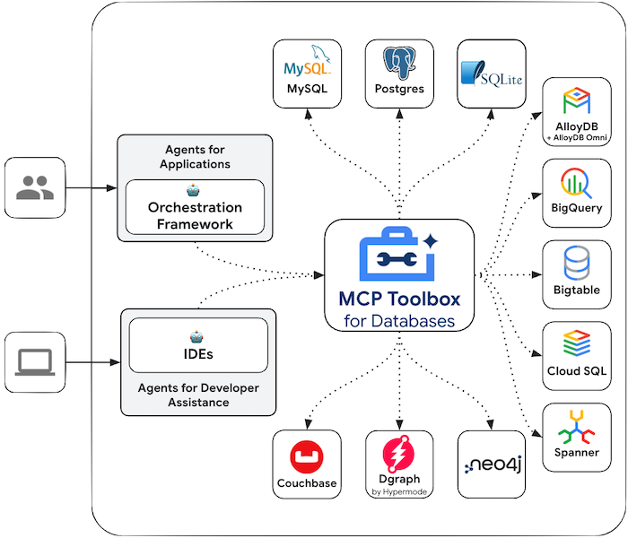

# MCP Toolbox for Databases

[MCP Toolbox for Databases](https://github.com/googleapis/genai-toolbox) is an open source MCP server for databases. It was designed with enterprise-grade and production-quality in mind. It enables you to develop tools easier, faster, and more securely by handling the complexities such as connection pooling, authentication, and more.

Toolbox Tools can be seemlessly integrated with Langchain applications. For more
information on [getting
started](https://googleapis.github.io/genai-toolbox/getting-started/local_quickstart_js/) or
[configuring](https://googleapis.github.io/genai-toolbox/getting-started/configure/)
Toolbox, see the
[documentation](https://googleapis.github.io/genai-toolbox/getting-started/introduction/).



### Configure and deploy

Toolbox is an open source server that you deploy and manage yourself. For more
instructions on deploying and configuring, see the official Toolbox
documentation:

- [Installing the Server](https://googleapis.github.io/genai-toolbox/getting-started/introduction/#installing-the-server)
- [Configuring Toolbox](https://googleapis.github.io/genai-toolbox/getting-started/configure/)

### Install client SDK

Langchain relies on the `@toolbox-sdk/core` node package to use Toolbox. Install the
package before getting started:

```shell
npm install @toolbox-sdk/core
```

### Loading Toolbox Tools

Once your Toolbox server is configured and up and running, you can load tools
from your server using the SDK:

```javascript
import { ChatVertexAI } from "@langchain/google-vertexai"
import { ToolboxClient } from "@toolbox-sdk/core";
import { tool } from "@langchain/core/tools";
import { createReactAgent } from "@langchain/langgraph/prebuilt";

const model = new ChatVertexAI({
  model: "gemini-2.0-flash",
  temperature: 0,
  maxRetries: 2,
});

// Replace with your Toolbox Server URL
const URL = 'http://127.0.0.1:5000';

let client = ToolboxClient(URL);
toolboxTools = await client.loadToolset('toolsetName');

const getTool = (toolboxTool) => tool(toolboxTool, {
    name: toolboxTool.getName(),
    description: toolboxTool.getDescription(),
    schema: toolboxTool.getParamSchema()
});
const tools = toolboxTools.map(getTool);

const agent = createReactAgent({ llm: model, tools });
let inputs = { messages: [{ role: "user", content: Some query" }] };
let response = await agent.invoke(inputs);
console.log(response);
```

### Advanced Toolbox Features

Toolbox has a variety of features to make developing Gen AI tools for databases seamless.
For more information, read more about the following:

- [Authenticated Parameters](https://googleapis.github.io/genai-toolbox/resources/tools/#authenticated-parameters): bind tool inputs to values from OIDC tokens automatically, making it easy to run sensitive queries without potentially leaking data
- [Authorized Invocations](https://googleapis.github.io/genai-toolbox/resources/tools/#authorized-invocations): restrict access to use a tool based on the users Auth token
- [OpenTelemetry](https://googleapis.github.io/genai-toolbox/how-to/export_telemetry/): get metrics and tracing from Toolbox with [OpenTelemetry](https://opentelemetry.io/docs/)
