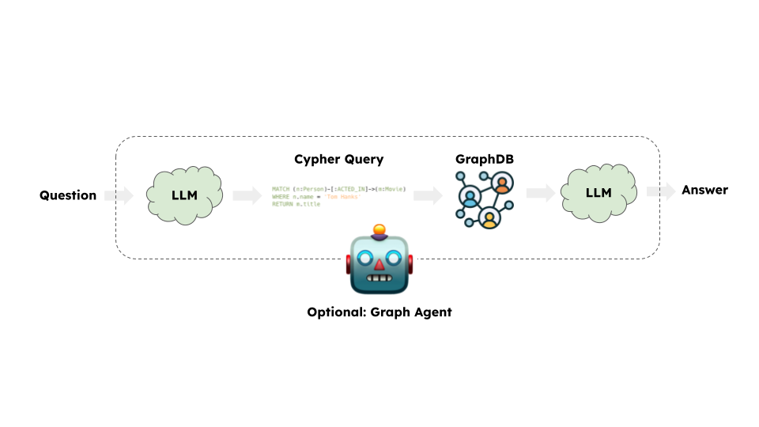

# Graphs

One of the common types of databases that we can build Q&A systems for are graph databases. LangChain comes with a number of built-in chains and agents that are compatible with graph query language dialects like Cypher, Neo4j, and MemGraph. They enable use cases such as:

* Generating queries that will be run based on natural language questions,
* Creating chatbots that can answer questions based on database data,
* Building custom dashboards based on insights a user wants to analyze,

and much more.

## ⚠️ Security note ⚠️

Building Q&A systems of graph databases might require executing model-generated database queries. There are inherent risks in doing this. Make sure that your database connection permissions are always scoped as narrowly as possible for your chain/agent's needs. This will mitigate though not eliminate the risks of building a model-driven system. For more on general security best practices, [see here](/docs/security).

> Employing database query templates within a semantic layer provides the advantage of bypassing the need for database query generation. This approach effectively eradicates security vulnerabilities linked to the generation of database queries.

## Architecture

At a high-level, the steps of most graph chains are:

1. **Convert question to a graph database query**: Model converts user input to a graph database query (e.g. Cypher).
2. **Execute graph database query**: Execute the graph database query.
3. **Answer the question**: Model responds to user input using the query results.