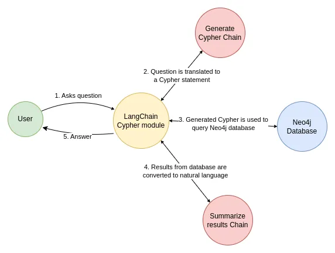

# Quickstart

In this guide we’ll go over the basic ways to create a Q&A chain over a
graph database. These systems will allow us to ask a question about the
data in a graph database and get back a natural language answer.

## ⚠️ Security note ⚠️ {#security-note}

Building Q&A systems of graph databases requires executing
model-generated graph queries. There are inherent risks in doing this.
Make sure that your database connection permissions are always scoped as
narrowly as possible for your chain/agent’s needs. This will mitigate
though not eliminate the risks of building a model-driven system. For
more on general security best practices, [see
here](../../../../docs/security).

## Architecture

At a high-level, the steps of most graph chains are:

1.  **Convert question to a graph database query**: Model converts user
    input to a graph database query (e.g. Cypher).
2.  **Execute graph database query**: Execute the graph database query.
3.  **Answer the question**: Model responds to user input using the
    query results.

<figure>
  
  <figcaption aria-hidden="true">SQL Use Case Diagram</figcaption>
</figure>

## Setup

First, get required packages and set environment variables. In this
example, we will be using Neo4j graph database.

## Setup

#### Install dependencies

```mdx-code-block
import IntegrationInstallTooltip from "@mdx_components/integration_install_tooltip.mdx";
import Npm2Yarn from "@theme/Npm2Yarn";

<IntegrationInstallTooltip></IntegrationInstallTooltip>

<Npm2Yarn>
  langchain @langchain/community @langchain/openai neo4j-driver
</Npm2Yarn>
```

#### Set environment variables

We’ll use OpenAI in this example:

```env
OPENAI_API_KEY=your-api-key

# Optional, use LangSmith for best-in-class observability
LANGSMITH_API_KEY=your-api-key
LANGCHAIN_TRACING_V2=true
```

Next, we need to define Neo4j credentials. Follow [these installation
steps](https://neo4j.com/docs/operations-manual/current/installation/)
to set up a Neo4j database.

```env
NEO4J_URI="bolt://localhost:7687"
NEO4J_USERNAME="neo4j"
NEO4J_PASSWORD="password"
```

The below example will create a connection with a Neo4j database and
will populate it with example data about movies and their actors.

```typescript
import "neo4j-driver";
import { Neo4jGraph } from "@langchain/community/graphs/neo4j_graph";

const url = Deno.env.get("NEO4J_URI");
const username = Deno.env.get("NEO4J_USER");
const password = Deno.env.get("NEO4J_PASSWORD");
const graph = await Neo4jGraph.initialize({ url, username, password });

// Import movie information
const moviesQuery = `LOAD CSV WITH HEADERS FROM 
'https://raw.githubusercontent.com/tomasonjo/blog-datasets/main/movies/movies_small.csv'
AS row
MERGE (m:Movie {id:row.movieId})
SET m.released = date(row.released),
    m.title = row.title,
    m.imdbRating = toFloat(row.imdbRating)
FOREACH (director in split(row.director, '|') | 
    MERGE (p:Person {name:trim(director)})
    MERGE (p)-[:DIRECTED]->(m))
FOREACH (actor in split(row.actors, '|') | 
    MERGE (p:Person {name:trim(actor)})
    MERGE (p)-[:ACTED_IN]->(m))
FOREACH (genre in split(row.genres, '|') | 
    MERGE (g:Genre {name:trim(genre)})
    MERGE (m)-[:IN_GENRE]->(g))`;

await graph.query(moviesQuery);
```

```text
Schema refreshed successfully.
```

```text
[]
```

## Graph schema

In order for an LLM to be able to generate a Cypher statement, it needs
information about the graph schema. When you instantiate a graph object,
it retrieves the information about the graph schema. If you later make
any changes to the graph, you can run the `refreshSchema` method to
refresh the schema information.

```typescript
await graph.refreshSchema();
console.log(graph.schema);
```

```text
Node properties are the following:
Movie {imdbRating: FLOAT, id: STRING, released: DATE, title: STRING}, Person {name: STRING}, Genre {name: STRING}
Relationship properties are the following:

The relationships are the following:
(:Movie)-[:IN_GENRE]->(:Genre), (:Person)-[:DIRECTED]->(:Movie), (:Person)-[:ACTED_IN]->(:Movie)
```

Great! We’ve got a graph database that we can query. Now let’s try
hooking it up to an LLM.

## Chain

Let’s use a simple chain that takes a question, turns it into a Cypher
query, executes the query, and uses the result to answer the original
question.

<figure>
  
  <figcaption aria-hidden="true">graph_chain.webp</figcaption>
</figure>

LangChain comes with a built-in chain for this workflow that is designed
to work with Neo4j:
[GraphCypherQAChain](https://python.langchain.com/docs/use_cases/graph/graph_cypher_qa)

```typescript
import { GraphCypherQAChain } from "langchain/chains/graph_qa/cypher";
import { ChatOpenAI } from "@langchain/openai";

const llm = new ChatOpenAI({ model: "gpt-3.5-turbo", temperature: 0 });
const chain = GraphCypherQAChain.fromLLM({
  llm,
  graph,
});
const response = await chain.invoke({
  query: "What was the cast of the Casino?",
});
response;
```

```text
{ result: "James Woods, Joe Pesci, Robert De Niro, Sharon Stone" }
```

### Next steps

For more complex query-generation, we may want to create few-shot
prompts or add query-checking steps. For advanced techniques like this
and more check out:

- [Prompting strategies](../../../../docs/use_cases/graph/prompting):
  Advanced prompt engineering techniques.
- [Mapping values](../../../../docs/use_cases/graph/mapping):
  Techniques for mapping values from questions to database.
- [Semantic layer](../../../../docs/use_cases/graph/semantic):
  Techniques for working implementing semantic layers.
- [Constructing
  graphs](../../../../docs/use_cases/graph/construction): Techniques
  for constructing knowledge graphs.
