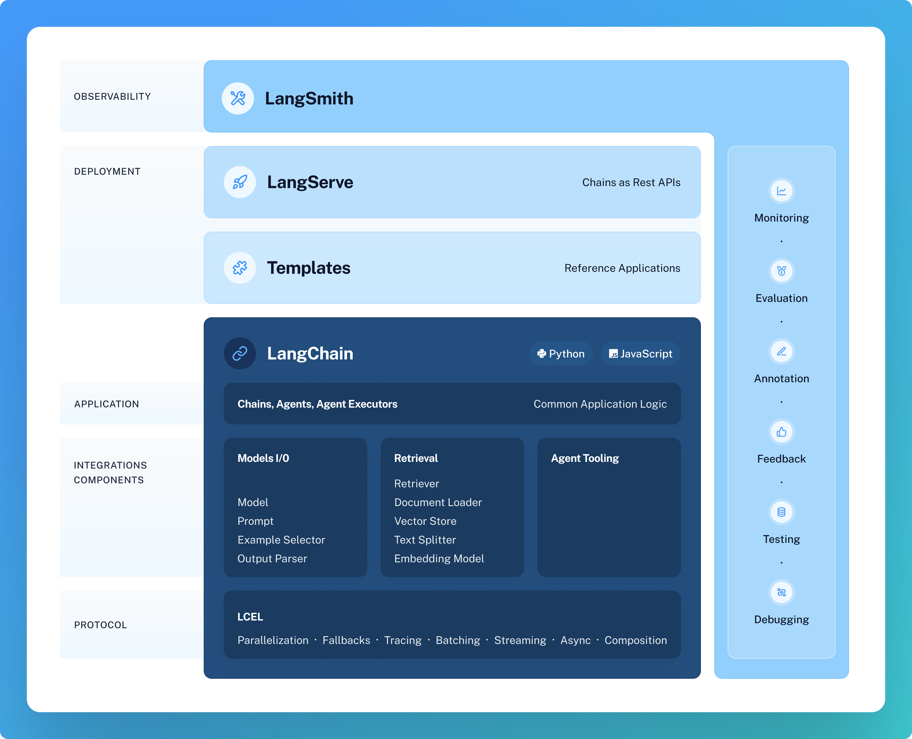

# 🦜🍎️ @langchain/core

[](https://github.com/langchain-ai/langchainjs/actions/workflows/ci.yml)  [](https://opensource.org/licenses/MIT) [](https://twitter.com/langchainai) [](https://discord.gg/6adMQxSpJS)

`@langchain/core` contains the core abstractions and schemas of LangChain.js, including base classes for language models,
chat models, vectorstores, retrievers, and runnables.

## 💾 Quick Install

```bash
$ yarn add @langchain/core
```

## 🤔 What is this?

`@langchain/core` contains the base abstractions that power the rest of the LangChain ecosystem. 
These abstractions are designed to be as modular and simple as possible.
Examples of these abstractions include those for language models, document loaders, embedding models, vectorstores, retrievers, and more.
The benefit of having these abstractions is that any provider can implement the required interface and then easily be used in the rest of the LangChain ecosystem.

For example, you can install other provider-specific packages like this:

```bash
$ yarn add @langchain/openai
```

And use them as follows:

```typescript
import { StringOutputParser } from "@langchain/core/output_parsers";
import { ChatPromptTemplate } from "@langchain/core/prompts";
import { ChatOpenAI } from "@langchain/openai";

const prompt = ChatPromptTemplate.fromTemplate(
  `Answer the following question to the best of your ability:\n{question}`
);

const model = new ChatOpenAI({
  temperature: 0.8,
});

const outputParser = new StringOutputParser();

const chain = prompt.pipe(model).pipe(outputParser);

const stream = await chain.stream({
  question: "Why is the sky blue?",
});

for await (const chunk of stream) {
  console.log(chunk);
}

/*
The
 sky
 appears
 blue
 because
 of
 a
 phenomenon
 known
 as
 Ray
leigh
 scattering
*/
```

Note that for compatibility, all used LangChain packages (including the base LangChain package, which itself depends on core!) must share the same version of `@langchain/core`.
This means that you may need to install/resolve a specific version of `@langchain/core` that matches the dependencies of your used packages.

## 🔗 What is LangChain Expression Language?

LangChain Core also contains LangChain Expression Language, or LCEL, a runtime that allows users to compose arbitrary sequences together and get several benefits that are important when building LLM applications.
We call these sequences “runnables”.

All runnables expose the same interface with single-invocation, batch, streaming and async methods.
This design is useful because it is not enough to have a single sync interface when building an LLM application.
Batch is needed for efficient processing of many inputs.
Streaming (and streaming of intermediate steps) is needed to show the user that progress is being made.
Async interfaces are nice when moving into production.
Rather than having to write multiple implementations for all of those, LCEL allows you to write a runnable once and invoke it in many different ways.

For more check out the [LCEL docs](https://js.langchain.com/docs/expression_language/).



## 📕 Releases & Versioning

`@langchain/core` is currently on version `0.1.x`.

As `@langchain/core` contains the base abstractions and runtime for the whole LangChain ecosystem, we will communicate any breaking changes with advance notice and version bumps. The exception for this is anything in `@langchain/core/beta`. The reason for `@langchain/core/beta` is that given the rate of change of the field, being able to move quickly is still a priority, and this module is our attempt to do so.

Minor version increases will occur for:

- Breaking changes for any public interfaces NOT in `@langchain/core/beta`

Patch version increases will occur for:

- Bug fixes
- New features
- Any changes to private interfaces
- Any changes to `@langchain/core/beta`

## 📦 Creating your own package

Other LangChain packages should add this package as a dependency and extend the classes within.
For an example, see the [@langchain/anthropic](https://github.com/langchain-ai/langchainjs/tree/main/libs/langchain-anthropic) in this repo.

Because all used packages must share the same version of core, we suggest using a tilde dependency to allow for different (backwards-compatible) patch versions:

```json
{
  "name": "@langchain/anthropic",
  "version": "0.0.3",
  "description": "Anthropic integrations for LangChain.js",
  "type": "module",
  "author": "LangChain",
  "license": "MIT",
  "dependencies": {
    "@anthropic-ai/sdk": "^0.10.0",
    "@langchain/core": "~0.1.0"
  }
}
```

This recommendation will change to a caret once a major version (1.x.x) release has occurred.

We suggest making all packages cross-compatible with ESM and CJS using a build step like the one in 
[@langchain/anthropic](https://github.com/langchain-ai/langchainjs/tree/main/libs/langchain-anthropic), then running `yarn build` before running `npm publish`.

We will be exploring how to make this process easier in the future.

## 💁 Contributing

Because `@langchain/core` is a low-level package whose abstractions will change infrequently, most contributions should be made in the higher-level LangChain package.

Bugfixes or suggestions should be made using the same guidelines as the main package.
See [here](https://github.com/langchain-ai/langchainjs/tree/main/CONTRIBUTING.md) for detailed information.

Please report any security issues or concerns following our [security guidelines](https://github.com/langchain-ai/langchainjs/tree/main/SECURITY.md).
